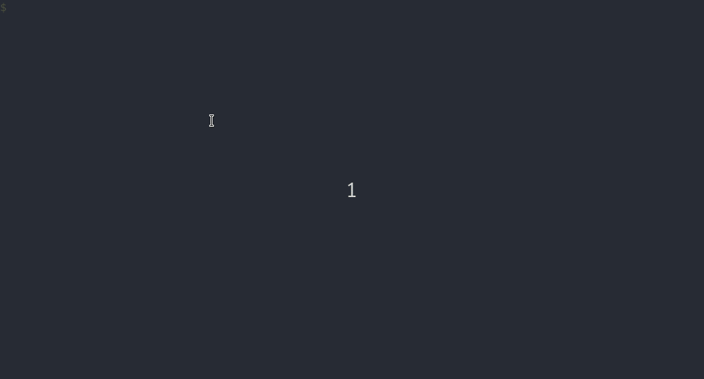

# HelmChart Flux2 Controller

## Helm source options
Translated repository (Github Pages) with yaml index
Artifact Hub (https://artifacthub.io/)
Harbor or any private repository helmchart museum

## Useful Sources

### HelmChart Repo
Most handy translated Git repo to Helm via Github Pages.

Requirements:

* Github Pages with helmchart index.yaml based on: [documentation](https://helm.sh/docs/topics/chart_repository/) 
* helmRepository, helmRelease (flux infrastructure array, can be separated repo)

Creating objects:

2 ways:

declarative = export flux objects to manifests
imperative  = apply objet to kubernetes cluster 

Preffered way is declarative, export manifests and then add them to github repo.
<br/>
<br/>
`Be aware files must be store in flux infra directory (clusters/flux-poc) otherwise flux will be not able to apply them during reconcilation process. Second important thing is create namespace on the cluster however this process can be automated using kustomize controller.` 

```
kubectl create namespace sample-apps
```


Create helm repository manifest file
```
flux create source helm apprepo \
--url=https://devopsapp84.github.io/flux2-capabilities/ \
--interval=10m \
--export > app-helmrepository.yaml
```




Fantastic feature is create helm release manifest using overwriten values file!

Before you create manifest make sure that values-override.yaml exists.

example values:
```
service:
  name: app01
  type: LoadBalancer
  port: 81
```

Create helm chart release manifest
```
flux create hr app01 --source=HelmRepository/apprepo --chart=app01 --values=../../charts/app01/values-override.yaml --target-namespace=sample-apps --export > app01-helmrelease.yaml
```

Add files to staging area commit them and push to github. After several minutes you should see deployment on your kubernetes cluster in sample-apps namespace. Interval can be shorter then you will see changes earlier.

### Github raw directory
Requirements:

* raw helmchart directory structure (have look into charts dir)
* gitRepository, helmRelease (flux infrastructure array, can be separated repo)

We have already gitRepository in place case for serving helmchart structure we use same repo.


Create helm chart release manifest
```
flux create hr app02 --interval=10m --source=GitRepository/flux-system --chart=./charts/app02 --values=../../charts/app02/values-override.yaml --target-namespace=sample-apps --export > app02-helmrelease.yaml
```